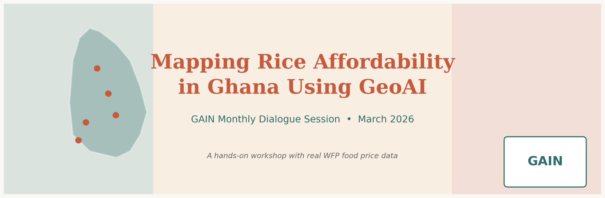
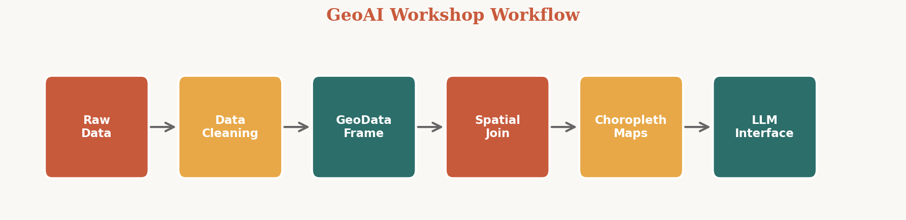
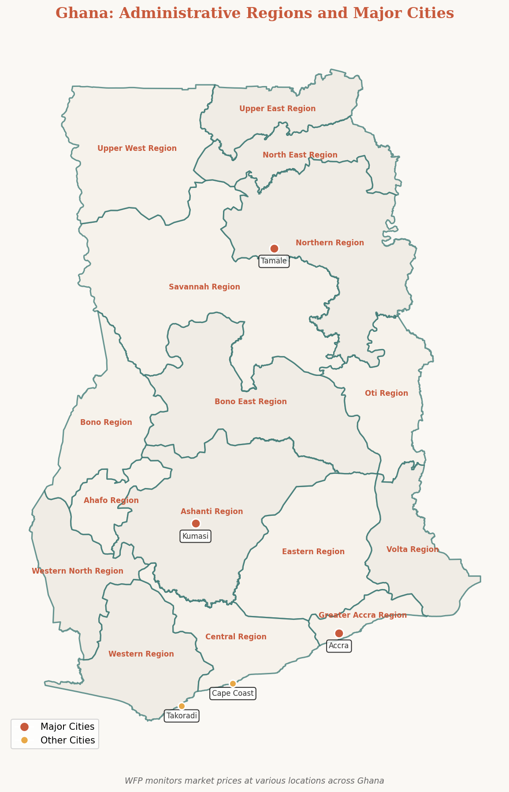
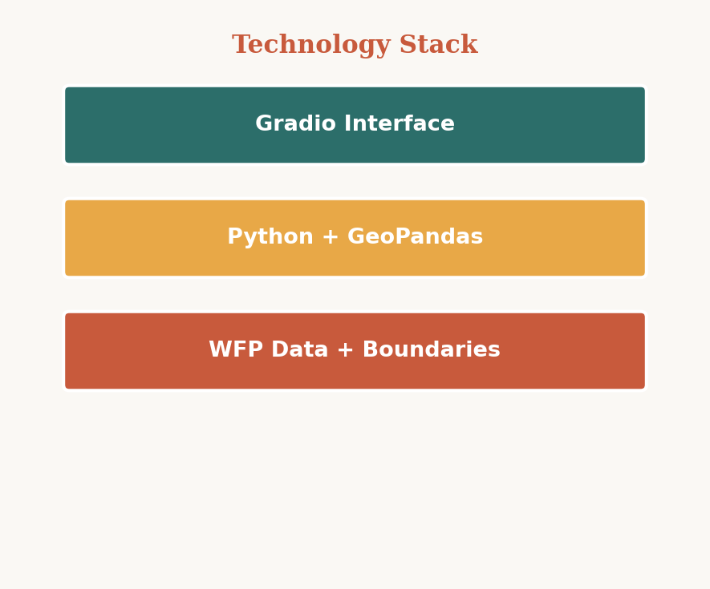
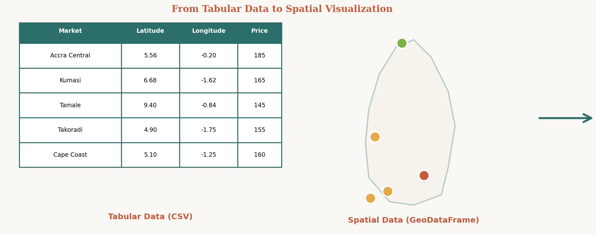
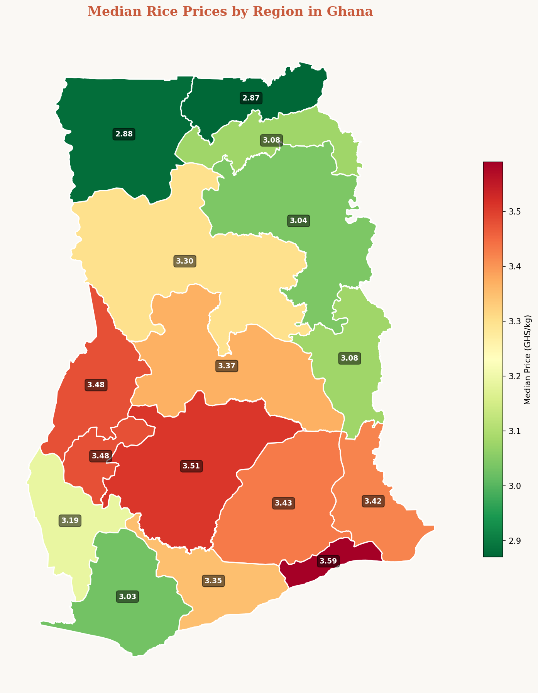
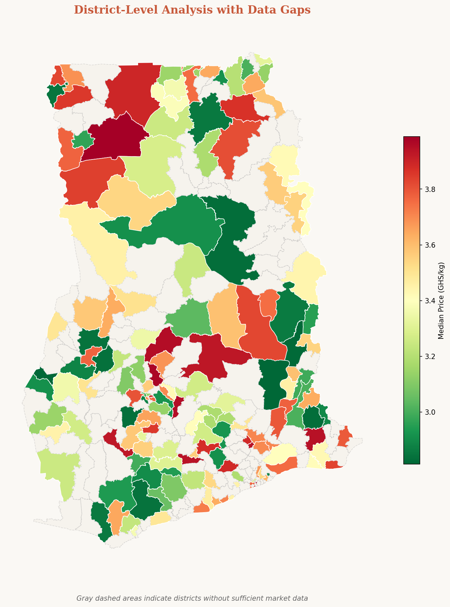
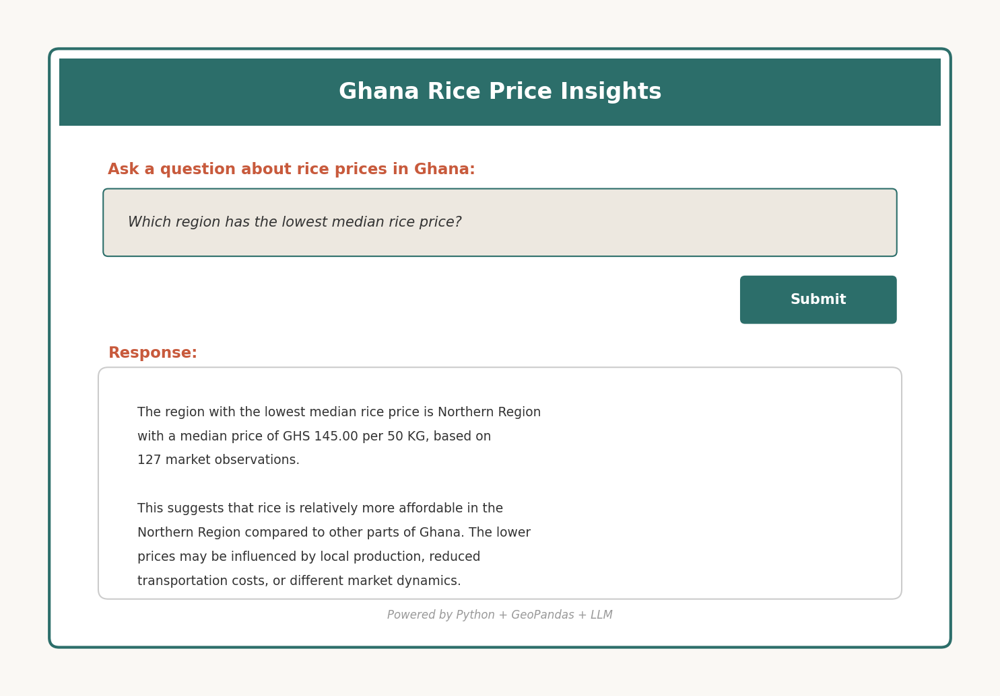

# Mapping Rice Affordability in Ghana Using GeoAI



**GAIN Monthly Dialogue Session – March 2026**  
Created by Chantelle Amoako-Atta, AI/ML Engineer and PhD Researcher (Decarb-AI, UCD)

---

## Overview

This repository contains materials for a 2-hour hands-on GeoAI workshop that uses real Ghanaian market data to explore spatial affordability patterns for rice. Participants will learn to:

- Load and analyze food price data from the World Food Programme (WFP)
- Create geospatial visualizations using Python
- Build choropleth maps showing regional and district-level patterns
- Identify and interpret data gaps
- Develop a natural language interface using Large Language Models (LLMs)

### Workshop Workflow



*This workshop takes you from raw market data to interactive spatial analysis in six steps.*

---

## Learning Outcomes

By the end of this workshop, participants will be able to:

1. Understand what GeoAI means in a practical Ghanaian context
2. Load and explore real-world food price datasets from WFP
3. Convert tabular market data into geospatial data using GeoPandas
4. Use spatial joins to link observations to administrative boundaries
5. Create choropleth maps showing spatial price variations
6. Identify data gaps and understand their policy implications
7. Build a natural language interface for querying spatial analysis

---

## Repository Structure

```
gain_geoai_workshop/
├── README.md                          # This file
├── images/                            # Images for README
│   ├── workshop-banner.png
│   ├── workflow-diagram.png
│   ├── regional-map-example.png
│   ├── district-map-example.png
│   ├── ghana-context-map.png
│   ├── table-to-map.png
│   ├── tech-stack.png
│   └── gradio-interface.png
├── data/                              # Data files (see Data Sources section)
│   ├── wfp_food_prices_gha.csv       # WFP Ghana food prices
│   ├── geoBoundaries-GHA-ADM1.geojson # Regional boundaries
│   └── geoBoundaries-GHA-ADM2.geojson # District boundaries
├── notebooks/
│   └── complete_workshop_notebook.ipynb # Main workshop notebook
├── slides/
│   └── GeoAI_Workshop_Slides.pptx    # Presentation slides
├── docs/
│   ├── instructor_notes.md            # Teaching guide for instructors
│   ├── student_handout.md             # Student reference guide
│   └── quick_start.md                 # Pre-workshop setup instructions
├── requirements.txt                   # Python dependencies
└── generate_ghana_maps.py             # Script to generate map images
```

---

## Getting Started

### Prerequisites

- Python 3.10 or higher
- Jupyter Notebook or JupyterLab
- Basic knowledge of Python and pandas

### Installation

1. **Clone this repository:**
   ```bash
   git clone https://github.com/chantelleaa/gain_geoai_workshop.git
   cd gain_geoai_workshop
   ```

2. **Create a virtual environment (recommended):**
   ```bash
   python -m venv venv
   source venv/bin/activate  # On Windows: venv\Scripts\activate
   ```

3. **Install dependencies:**
   ```bash
   pip install -r requirements.txt
   ```

4. **Download data files** (see Data Sources section below)

5. **Launch Jupyter:**
   ```bash
   jupyter notebook
   ```

6. **Open the workshop notebook:**
   Navigate to `notebooks/complete_workshop_notebook.ipynb`

---

## Data Sources

### Geographic Context



*Ghana's administrative regions and major cities where WFP monitors market prices.*

### WFP Food Prices for Ghana
- **Source:** World Food Programme via Humanitarian Data Exchange (HDX)
- **URL:** https://data.humdata.org/dataset/wfp-food-prices-for-ghana
- **Description:** Market-level food prices for various commodities including rice
- **License:** Public domain / Open data
- **Download:** Place in `data/wfp_food_prices_gha.csv`

### Ghana Administrative Boundaries
- **Source:** geoBoundaries
- **URL:** https://www.geoboundaries.org/
- **Description:** Polygon boundaries for Ghana's regions (ADM1) and districts (ADM2)
- **License:** Open data
- **Files needed:**
  - ADM1 (Regions): `geoBoundaries-GHA-ADM1.geojson`
  - ADM2 (Districts): `geoBoundaries-GHA-ADM2.geojson`

**Note:** Data files are not included in this repository due to size. Please download them from the sources above.

---

## Workshop Materials

### For Participants
- **Workshop Notebook** (`notebooks/complete_workshop_notebook.ipynb`): Complete with code, explanations, and reflection questions
- **Student Handout** (`docs/student_handout.md`): Core concepts, guided questions, and note-taking space
- **Presentation Slides** (`slides/GeoAI_Workshop_Slides.pptx`): Introduction and overview

### For Instructors
- **Instructor Notes** (`docs/instructor_notes.md`): Detailed teaching plan with timing, engagement strategies, and troubleshooting
- **Presentation Slides** (`slides/GeoAI_Workshop_Slides.pptx`): Use to introduce the workshop

---

## Technical Requirements

### Technology Stack



*The workshop uses a layered architecture: Gradio for the interface, Python and GeoPandas for analysis, and WFP data as the foundation.*

### Python Libraries
- **pandas** (2.0+): Data manipulation
- **geopandas** (0.14+): Geospatial data operations
- **matplotlib** (3.7+): Plotting and visualization
- **shapely** (2.0+): Geometric operations
- **gradio** (4.0+): Natural language interface
- **jupyter**: Interactive notebooks

Install all dependencies with:
```bash
pip install -r requirements.txt
```

### Optional (for LLM interface)
- API access to an LLM service (e.g., OpenAI, Anthropic)
- Or use the deterministic Python-only fallback provided in the notebook

---

## Workshop Agenda (2 Hours)

| Time | Activity | Description |
|------|----------|-------------|
| 0–10 min | Introduction | Context, WFP background, learning outcomes |
| 10–30 min | Data Loading | Explore datasets, filter rice, validate coordinates |
| 30–55 min | Regional Analysis | Create GeoDataFrame, spatial joins, ADM1 choropleth |
| 55–80 min | District Analysis | ADM2 mapping, identify data gaps |
| 80–100 min | LLM Interface | Build Gradio app for natural language queries |
| 100–120 min | Discussion | Reflections, applications, extensions |


## Key Concepts Covered

### GeoAI
Using artificial intelligence and geographic data together to answer location-specific questions.

### Spatial Join



*Converting tabular market data with coordinates into spatial points on a map through GeoDataFrame creation.*

### Choropleth Map



*Example choropleth map showing median rice prices across Ghana's regions. Color coding reveals spatial affordability patterns: green indicates more affordable areas, while red shows regions with higher prices.*

### Data Gaps



*District-level analysis reveals both price patterns and data coverage gaps. Colored districts have sufficient market observations, while gray outlined districts lack data, highlighting areas where monitoring could be expanded.*

### LLM for Explanation



*The workshop includes building an interactive Gradio interface that allows users to query rice price data using natural language. Python handles all computations while the LLM generates human-friendly explanations.*

---

## Extension Ideas

After completing the workshop, consider these extensions:

1. **Compare rice varieties:** Local vs imported rice price patterns
2. **Add temporal dimension:** Animate price changes over time
3. **Include other commodities:** Maize, cassava, gari, tomatoes
4. **Combine with demographics:** Population and poverty data
5. **Deploy publicly:** Share Gradio app via Hugging Face Spaces
6. **Build a dashboard:** Use Streamlit or Dash for interactive exploration

---

## Additional Resources

### Documentation
- [GeoPandas Documentation](https://geopandas.org/)
- [WFP Food Price Monitoring](https://www.wfp.org/)
- [Humanitarian Data Exchange (HDX)](https://data.humdata.org/)
- [geoBoundaries Documentation](https://www.geoboundaries.org/)

### Learning Materials
- [Introduction to Geospatial Analysis with Python](https://automating-gis-processes.github.io/site/)
- [Spatial Data Science](https://rspatial.org/)
- [GeoAI and Machine Learning for Spatial Data](https://www.esri.com/en-us/arcgis/products/geoai)

---

## Contributing

Contributions are welcome! If you find issues or have suggestions for improvements:

1. Fork this repository
2. Create a feature branch (`git checkout -b feature/improvement`)
3. Commit your changes (`git commit -am 'Add improvement'`)
4. Push to the branch (`git push origin feature/improvement`)
5. Open a Pull Request

---

## Contact

**Chantelle Amoako-Atta**  
AI/ML Engineer and PhD Researcher  
Decarb-AI, University College Dublin (UCD)

For questions about the workshop or materials, please open an issue in this repository.

---

## License

This workshop material is shared for educational purposes. Please cite this repository if you use or adapt these materials.

**Citation:**
```
Amoako-Atta, C. (2026). Mapping Rice Affordability in Ghana Using GeoAI. 
GAIN Monthly Dialogue Session Workshop Materials.
```

---

## Acknowledgments

- **World Food Programme (WFP)** for providing open food price data
- **Humanitarian Data Exchange (HDX)** for data accessibility
- **geoBoundaries** for administrative boundary data
- **GAIN** for hosting the Monthly Dialogue Session

---

## About GAIN

The Global Alliance for Improved Nutrition (GAIN) is a Swiss-based foundation launched at the UN in 2002 to tackle the human suffering caused by malnutrition. GAIN's Monthly Dialogue Sessions provide a platform for knowledge sharing and capacity building.

---

**Last Updated:** December 2025  
**Workshop Date:** March 2026